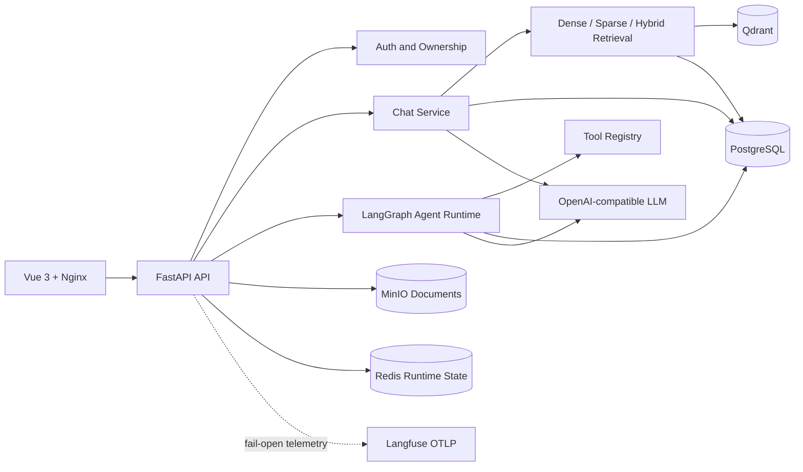

# AgentHub Architecture

The production Compose file places PostgreSQL, Redis, Qdrant, MinIO, and the
backend on a private bridge network. Nginx is the only published application
entry point. Business logic remains behind API → Service → Repository layers;
providers are injected through adapter contracts.
